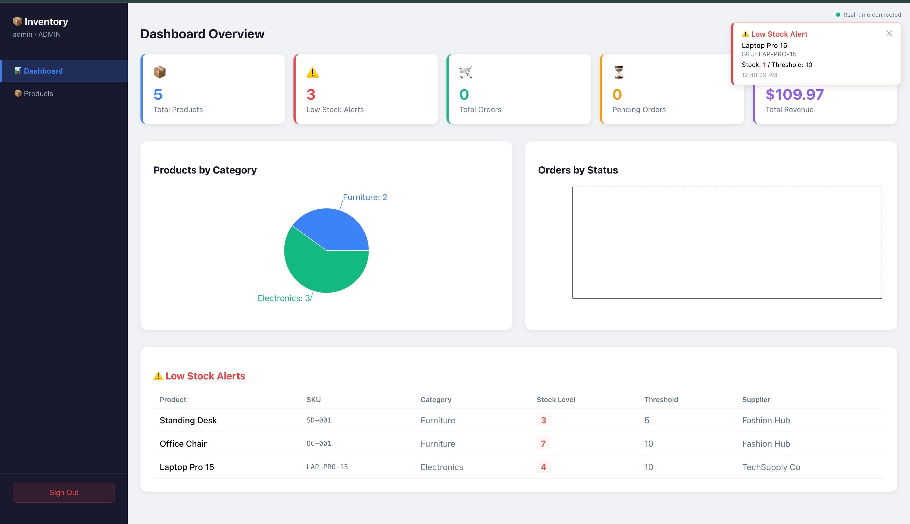

# Inventory Management System 📦

> Full-stack enterprise inventory management with React TypeScript frontend, Spring Boot Java backend, Node.js JWT middleware, GraphQL API, and Supabase real-time stock alerts.

## Architecture

```
React TypeScript (port 3000)
        ↓ JWT token
Node.js Middleware (port 4000) — JWT auth gateway
        ↓ proxy
Spring Boot Java (port 8080) — REST + GraphQL
        ↓
PostgreSQL (port 5434) — primary database
        ↓ sync on stock update
Supabase — real-time WebSocket broadcasting
        ↓
React frontend — instant low stock alert popup
```
## Screenshots

### Dashboard with Real-Time Alert


## Tech Stack

| Layer | Technology |
|---|---|
| Frontend | React TypeScript, Recharts, Supabase JS client |
| Auth Gateway | Node.js, Express, JWT |
| Backend | Spring Boot Java 21, Hibernate JPA |
| API | REST endpoints + GraphQL (10 queries, 1 mutation) |
| Database | PostgreSQL — 4 tables auto-created by Hibernate |
| Real-time | Supabase WebSocket subscriptions |
| Containerization | Docker |

## Features

**Dashboard:**
- KPI cards — total products, low stock alerts, orders, revenue
- Products by category pie chart
- Orders by status bar chart
- Live low stock alerts table

**Products:**
- Full CRUD with supplier relationship
- Inline stock update with instant feedback
- Low stock detection — red highlight when stock ≤ threshold
- Search by name, SKU, or category

**Real-time Alerts:**
- Supabase WebSocket subscription on products table
- Instant popup alert when stock drops below reorder threshold
- Connection status indicator (green dot = connected)
- Dismissable alert cards with timestamp

**Security:**
- JWT authentication via Node.js middleware
- 3 roles: ADMIN, MANAGER, VIEWER
- All API and GraphQL routes protected
- Spring Boot never receives unauthenticated requests

**GraphQL:**
- 10 queries: products, product, productBySku, productsByCategory, lowStockProducts, searchProducts, suppliers, supplier, orders, order
- 1 mutation: updateStock
- GraphiQL UI at localhost:8080/graphiql

## Setup

```bash
git clone https://github.com/sarvagna23/inventory-management
cd inventory-management

# Start PostgreSQL
docker-compose up -d

# Start Spring Boot backend
cd backend
mvn spring-boot:run

# Start Node.js middleware
cd ../middleware
node src/server.js

# Start React frontend
cd ../frontend
npm install
npm start
```

**Environment variables needed in `frontend/.env`:**
```
REACT_APP_SUPABASE_URL=your-supabase-url
REACT_APP_SUPABASE_ANON_KEY=your-anon-key
```

**Add to `backend/src/main/resources/application.properties`:**
```
supabase.url=your-supabase-url
supabase.anon-key=your-anon-key
```

## Demo Credentials

| Username | Password | Role |
|---|---|---|
| admin | admin123 | ADMIN |
| manager | manager123 | MANAGER |
| viewer | viewer123 | VIEWER |

## Key Technical Decisions

**Why Node.js middleware instead of Spring Security?**
Node.js acts as an API gateway — validates JWT tokens before requests reach Spring Boot. This decouples auth from business logic and is the standard enterprise pattern for microservices.

**Why GraphQL alongside REST?**
REST for writes (order processing needs transactions and validation). GraphQL for reads (frontend requests exactly the fields it needs — no over-fetching).

**Why Supabase for real-time?**
Local PostgreSQL doesn't have WebSocket broadcasting. Supabase adds a real-time layer with zero infrastructure overhead — stock updates sync to Supabase, which instantly broadcasts to all connected React clients.

**Why `@Transactional` on createOrder?**
Atomic order processing — validates stock for ALL items before deducting ANY. If one item is out of stock, the entire order rolls back. No partial data.

## Author

**Sai Sarvagna Beeram**
MS Computer Science — Georgia State University (Dec 2026)
GitHub: [sarvagna23](https://github.com/sarvagna23)
LinkedIn: [saisarvagna023](https://linkedin.com/in/saisarvagna023)
